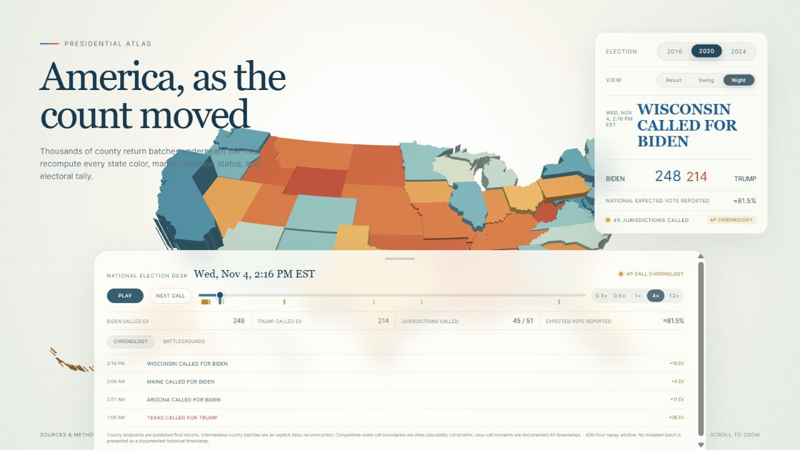
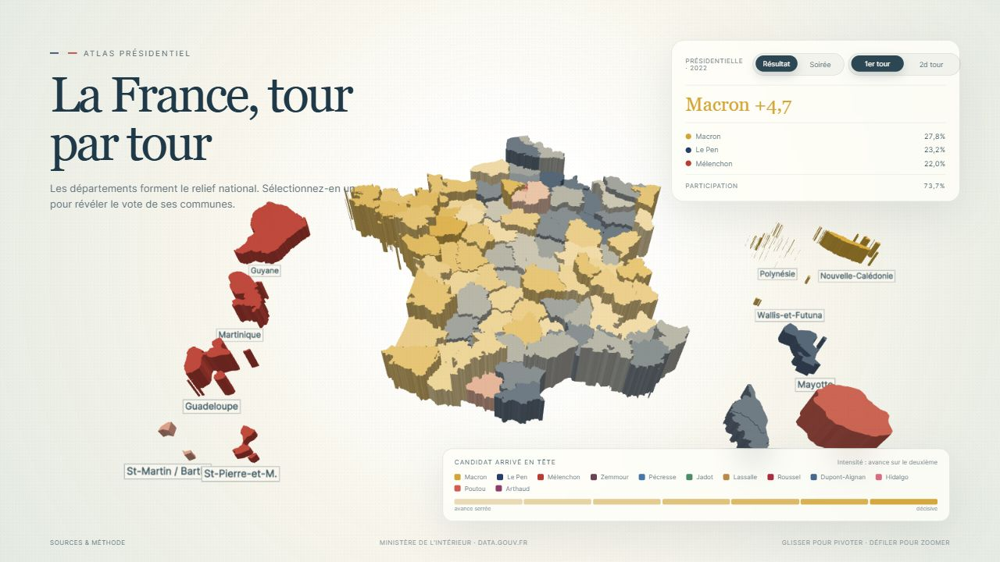

# Presidential Atlas

[](https://github.com/kevyisagenius123/3D/actions/workflows/pages.yml)
[](https://github.com/kevyisagenius123/3D/actions/workflows/quality.yml)
[](https://github.com/kevyisagenius123/3D/tags)

An interactive, three-dimensional atlas for exploring presidential elections
as geography, vote margin, turnout, and time.

[](https://kevyisagenius123.github.io/3D/election-atlas)

*Thousands of reconstructed county return batches recompute state margins,
decision status, outstanding vote, and the electoral tally as the count moves.*

## Explore

| Experience | Description |
| --- | --- |
| [United States Atlas](https://kevyisagenius123.github.io/3D/election-atlas) | State and county results, swing, and a reconstructed 2020 election-night replay. |
| [France Atlas](https://kevyisagenius123.github.io/3D/france-atlas) | 2022 results and reconstructed election night by department, territory, and commune. |

### France, territory by territory

<p align="center">
  <a href="https://kevyisagenius123.github.io/3D/france-atlas">
    
  </a>
</p>

## Highlights

- Three-dimensional state, county, department, and commune geography
- Expressive party-margin scales designed for close and landslide results
- State-to-county drill-down with clean terrain transitions
- 2016, 2020, and 2024 United States result and swing views
- A deterministic 2020 election-night reconstruction built from county return packets
- A 2022 France replay with modeled poll closings, staggered publication waves, and official polling-bureau totals
- Clickable overseas territory insets with commune-level drill-downs
- Decision-desk context explaining outstanding vote and race-call constraints
- Responsive controls for desktop, tablet, and mobile displays

## Election-night replay

The national timeline loads first. Individual state timelines are downloaded
only when a state is opened, keeping the initial experience lightweight. The
replay uses published final county returns, explicitly reconstructed
intermediate batches, and documented race-call times where available.

The reconstruction is an analytical historical experience—not a live result
feed, an official tabulation, or a claim that modeled batches were published at
their displayed intermediate timestamps. See [Data and methodology](docs/DATA_AND_METHODOLOGY.md).

The France replay begins before polls close, observes the 20:00 publication
embargo, and then reveals official 2022 polling-bureau totals through a
deterministic reconstruction. Poll-closing groups, reporting order, and exact
timestamps are modeled because a complete archived live return feed is not
available.

## Documentation

- [Data and methodology](docs/DATA_AND_METHODOLOGY.md)
- [France 2022 replay methodology](docs/FRANCE_2022_METHODOLOGY.md)
- [Changelog](CHANGELOG.md)
- [Contributing and result corrections](CONTRIBUTING.md)

## Repository scope

This repository is the curated, compiled distribution used by GitHub Pages.
The private React, TypeScript, and Java source projects are intentionally not
published here.

```text
.
├── .github/               Pages workflow and issue templates
├── docs/                  Public methodology
├── site/
│   ├── assets/            Minified production bundles
│   ├── data/              Public election and geometry data
│   ├── election-atlas/    United States route entry
│   └── france-atlas/      France route entry
└── README.md
```

Every push to `main` validates the publication boundary and deploys `site/` as
an immutable Pages artifact. The gate verifies every route's local assets,
allowlists public file types and directories, checks all replay jurisdictions,
scans for common secret signatures, and rejects source or source-map artifacts.

## Status and use

Presidential Atlas is an independent data-visualization project and is not an
official election authority or decision desk. Report reproducible problems
through [GitHub Issues](https://github.com/kevyisagenius123/3D/issues).

No open-source license is granted for the compiled application. Third-party
datasets remain subject to their respective source terms.
